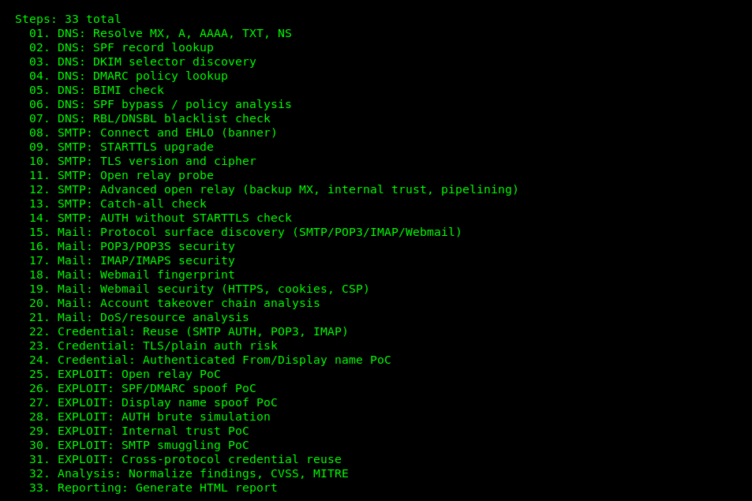
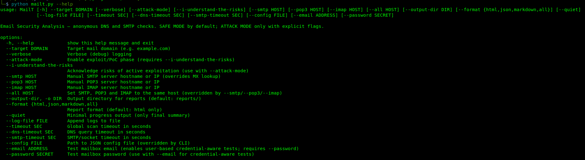
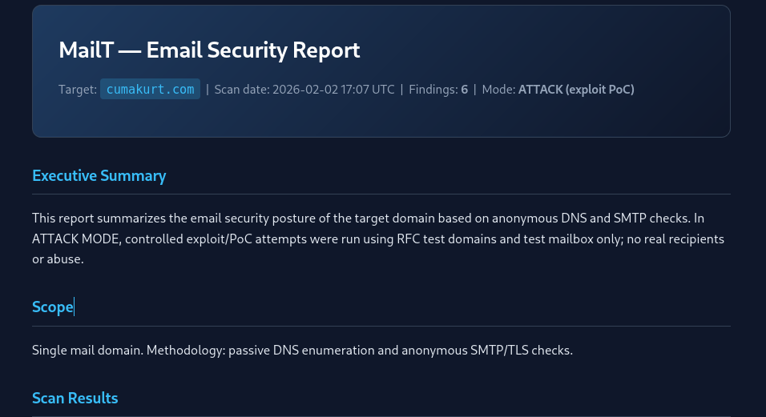

# MailT — Mail Ecosystem Attack Surface Framework

**Developed by [Cuma KURT](https://www.linkedin.com/in/cuma-kurt-34414917/)** — cumakurt@gmail.com  
**GitHub:** [https://github.com/cumakurt/mailt](https://github.com/cumakurt/mailt)

Email security and offensive assessment for a target mail domain: **RECON → BYPASS → EXPLOIT → PROOF → REPORT**. Supports DNS (MX, SPF, DKIM, DMARC, BIMI), **RBL/DNSBL blacklist check** (SMTP IP reputation), SMTP/TLS, POP3, IMAP, webmail discovery, and optional exploit/PoC modules. CVSS v3.1 and MITRE ATT&CK mapping.



## Requirements

- Python 3.10+
- [dnspython](https://www.dnspython.org/) (see `requirements.txt`)

MailT checks that `dnspython` is available before running; if missing, it prints a warning and exits.

## Install

```bash
python3 -m venv .venv
.venv/bin/activate
pip install -r requirements.txt
```

If `python3 mailt.py --help` shows a blank screen, use unbuffered output: `python3 -u mailt.py --help`.



## Usage

```bash
# Show help
python3 mailt.py --help

# Full scan (SAFE MODE): DNS + SMTP + Mail ecosystem (POP3/IMAP/Webmail discovery)
python3 mailt.py --target example.com

# Verbose
python3 mailt.py --target example.com --verbose

# ATTACK MODE (exploit/PoC): requires BOTH flags
python3 mailt.py --target example.com --attack-mode --i-understand-the-risks
```

**Note:** Without **both** `--attack-mode` and `--i-understand-the-risks`, no bruteforce, auth probing, exploit, or injection code runs.

### User-based (credential-aware) tests

When a test mailbox email and password are provided, MailT runs **credential-aware** tests to assess risk when an account is compromised: credential reuse across SMTP AUTH, POP3, IMAP; TLS/plain auth risk; authenticated From/display name PoC. Use only on **authorized** test accounts.

```bash
# Credential-aware: same email/password tested on SMTP AUTH, POP3, IMAP
python3 mailt.py --target example.com --email testuser@example.com --password "testpass"
```

**Note:** `--email` and `--password` must be provided together. No mail content is read; no data exfiltration; no persistent changes. PoC mail (authenticated spoof) is sent only to the test account itself.

### Output and reports

```bash
# Output directory (default: reports/)
python3 mailt.py --target example.com --output-dir /tmp/reports
python3 mailt.py --target example.com -o ./out

# Report format: html (default), json, markdown, or all
python3 mailt.py --target example.com --format json
python3 mailt.py --target example.com --format all

# Quiet: only final summary
python3 mailt.py --target example.com --quiet

# Log to file
python3 mailt.py --target example.com --log-file mailt.log
```

### Timeouts and config

```bash
# Global scan timeout (seconds)
python3 mailt.py --target example.com --timeout 300

# DNS and SMTP timeouts
python3 mailt.py --target example.com --dns-timeout 5 --smtp-timeout 10

# Config file (JSON); CLI overrides config and env
python3 mailt.py --target example.com --config mailt.json
```

### Configuration (env and config file)

Environment variables (optional): `MAILT_VERBOSE`, `MAILT_OUTPUT_DIR`, `MAILT_FORMAT`, `MAILT_QUIET`, `MAILT_LOG_FILE`, `MAILT_TIMEOUT`, `MAILT_DNS_TIMEOUT`, `MAILT_SMTP_TIMEOUT`. Config file (JSON) keys: `verbose`, `output_dir`, `format`, `quiet`, `log_file`, `timeout`, `dns_timeout`, `smtp_timeout`. Precedence: CLI > config file > env.

### Manual server host (override MX discovery)

```bash
# Manual SMTP server (hostname or IP)
python3 mailt.py --target example.com --smtp mail.example.com

# Manual POP3 and IMAP servers
python3 mailt.py --target example.com --pop3 pop.example.com --imap imap.example.com

# Set SMTP, POP3 and IMAP to the same host (--all overridden by --smtp/--pop3/--imap if given)
python3 mailt.py --target example.com --all 192.168.1.10
```

### Exit codes

- **0** — Scan completed successfully (no step errors).
- **1** — Validation or dependency error (e.g. invalid `--target`, missing dnspython).
- **2** — Scan failure (one or more steps failed or timeout).

## Operating Modes

### SAFE MODE (default)

- **Discovery:** MX, SPF, DKIM, DMARC, BIMI, PTR; **RBL/DNSBL blacklist check** (SMTP IPs tested against Spamhaus, Spamcop, SORBS, Barracuda, CBL, PSBL, UCEPROTECT, etc.); SMTP/POP3/IMAP port and webmail fingerprint.
- **Configuration analysis:** SPF bypass/subdomain, TLS cert, banner, gateway detection.
- **Passive checks:** Open relay probe (response codes only), catch-all, STARTTLS, TLS version/cipher.
- **Mail ecosystem:** Protocol surface (25/465/587, 110/995, 143/993), POP3/IMAP security (plain vs TLS), webmail fingerprint and security (HTTPS, cookies, CSP), account takeover chain correlation, DoS/resource analysis (NOOP/IDLE).

No credentials, no mail delivery, no abuse.

### ATTACK MODE (explicit opt-in)

Only when **both** `--attack-mode` and `--i-understand-the-risks` are set:

- **Exploit/PoC modules:** Open relay (external→external, RFC test domains), SPF/DMARC spoof, display name spoof, AUTH brute simulation (3–5 dummy attempts), internal trust PoC, SMTP smuggling PoC, cross-protocol credential reuse.
- **Controlled auth probing:** POP3/IMAP 3–5 attempts with dummy user/pass; rate limit and lockout detection.
- **Webmail:** Limited login attempts to check error message differences and rate limit.

Uses only RFC test domains (e.g. `example.net`, `example.org`) and test mailbox (`mailt-poc@example.org`). No real recipients, no spam, no malware.

## Output

Reports are written to `reports/` (or `--output-dir`). Format: `--format html|json|markdown|all`. Each report filename includes a UTC timestamp (`YYYYMMDD_HHMMSS`) so back-to-back scans do not overwrite the same file.



- **HTML report:** `mailt_report_<domain>_<timestamp>.html` — Executive Summary, Scope, Scan Results (DNS/SMTP data), Mail Ecosystem, **RBL/DNSBL Blacklist Results** (per-IP, per-RBL status and reputation score), DKIM selectors, SPF bypass, Open relay summary, Findings, Risk Matrix, MITRE ATT&CK, Action Plan.
- **JSON report:** `mailt_report_<domain>_<timestamp>.json` — Findings, summary, DNS/SMTP summary, **rbl_check** (full RBL results); suitable for CI/automation.
- **Markdown report:** `mailt_report_<domain>_<timestamp>.md` — Human-readable summary, **RBL/DNSBL results** table, and findings table.

If a step fails (e.g. DNS timeout), the scan continues; errors are recorded and reported. Use exit code 2 to detect scan failures in scripts.

## Progress Output

- Total steps and numbered list at start (unless `--quiet`).
- Per step: `[current/total] Step name (elapsed s) — X% complete, N steps left`
- With `--verbose`: short result after each step (e.g. `Pass: 2 MX record(s)`, `Open: smtp_25, pop3_110`).
- Final summary: total time and step count. With `--quiet`: only one-line completion message.

## RBL / DNSBL Blacklist Check

**Enabled by default.** SMTP IP addresses (from MX records and, if provided, `--smtp` or `--all`) are tested against global DNS-based blacklists (RBL/DNSBL) using **passive DNS only** (no third-party API or web scraping).

- **IPs tested:** All MX hostnames are resolved to IPv4/IPv6; if `--smtp` or `--all` is set, that host is included. Each unique IP is queried against each RBL zone.
- **RBL zones:** Spamhaus ZEN, Spamcop, SORBS, Barracuda, CBL, PSBL, UCEPROTECT L1, Spamhaus SBL/XBL (modular list in `dns_checks/rbl_check.py`).
- **Per blacklist result:** Each IP gets a result per zone: listed / not listed / timeout / error. Timeout and DNS failure are handled safely (no false positive).
- **Reputation score:** Per-IP score 0.0 (good) to 1.0 (bad), based on the fraction of RBLs that list the IP. Reported in the **RBL/DNSBL Blacklist Results** section of the report.
- **Info security interpretation:** Findings are raised when an IP is listed (reputation abuse, compromised relay risk); correlation with delivery failure and DMARC/SPF acceptance at receivers is noted.

## Project Structure

```
mailt/
├── mailt.py                    # Entry point (CLI: --target, --output-dir, --format, --quiet, etc.)
├── core/                       # Scanner, context, utils, progress, config, attack_mode
├── dns_checks/                 # DNS checks: MX, SPF, DKIM, DMARC, BIMI, SPF bypass, RBL/DNSBL (used by scanner)
├── smtp/                       # SMTP enum, STARTTLS, TLS, open relay, gateway detection
│   ├── mail_service_discovery  # SMTP/POP3/IMAP/Webmail port + banner
│   ├── pop3_security           # POP3/POP3S (SAFE + ATTACK auth probe)
│   ├── imap_security           # IMAP/IMAPS (SAFE + ATTACK login probe)
│   ├── webmail_fingerprint     # Webmail product/version
│   ├── webmail_security        # HTTPS, cookies, CSP; ATTACK: login probe
│   ├── cross_protocol_attack   # ATTACK: credential reuse across SMTP/POP3/IMAP
│   ├── mail_account_takeover_chain  # Chained risk (POP3/IMAP/webmail)
│   ├── mail_dos_analysis       # NOOP/IDLE; ATTACK: low-freq slow probe
│   └── *_exploit.py / *_poc.py # ATTACK MODE only
├── analysis/                   # Findings, CVSS, MITRE
├── reporting/                  # HTML, JSON, Markdown reports
├── data/                       # mitre_attack.json, cvss_metrics.json
├── img/                        # Screenshots and images (1.png, 2.png, 3.png)
├── requirements.txt
└── LICENSE
```

## Red Lines (Never Done)

- No real spam sending.
- No real recipient addresses.
- No malware or credential dump.
- No persistent changes to target systems.

Use only on domains you are **authorized** to test.

## Author

**Cuma KURT**  
- Email: cumakurt@gmail.com  
- LinkedIn: [linkedin.com/in/cuma-kurt-34414917](https://www.linkedin.com/in/cuma-kurt-34414917/)  
- GitHub: [github.com/cumakurt/mailt](https://github.com/cumakurt/mailt)

## GitHub

Repository: [github.com/cumakurt/mailt](https://github.com/cumakurt/mailt)

```bash
git clone https://github.com/cumakurt/mailt.git
cd mailt
python3 -m venv .venv && .venv/bin/activate
pip install -r requirements.txt
python3 mailt.py --help
```

## License

This project is licensed under the **GNU General Public License v3.0 or later (GPL-3.0-or-later)**. See [LICENSE](LICENSE) for the full text.

Use responsibly and only within authorized penetration testing and security assessment scope.
